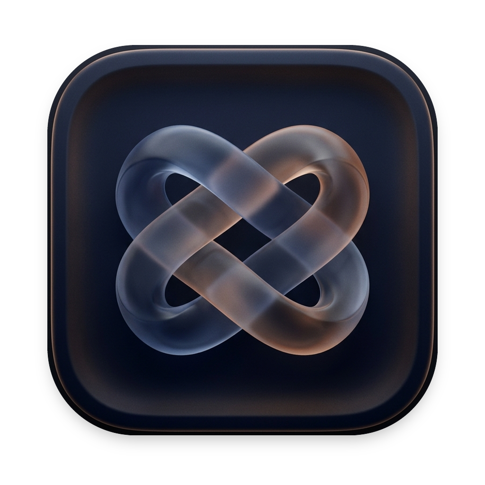

<div align="center">



# Waystation

### Run Chrome Web Store Extensions in Apple Safari — Effortlessly.

[](https://apple.com/macos)
[](https://swift.org)
[](https://developer.apple.com/xcode)
[](LICENSE)

</div>

---

## 🧭 Overview

**Waystation** is a native macOS companion app designed to bring Google Chrome Web Store extensions directly to Apple Safari without tedious manual command-line workflows. 

While Apple provides `safari-web-extension-converter`, using it manually requires downloading CRX archives, unpacking them, invoking terminal commands, setting up Xcode targets, managing signing identities, and manually re-signing them when free developer certificates expire.

**Waystation automates the entire pipeline into a single, cohesive Mac application.**

---

## ✨ Features

### 🛒 Integrated Chrome Web Store Browser
- Browse the official Chrome Web Store right inside Waystation.
- Injects a native **"Add to Safari"** button directly on extension detail pages.
- Downloads the latest `.crx` binaries directly from the official Google Web Store CDN.

### 📥 Drag & Drop Converter
- Already have an extension archive or directory? Simply drop:
  - `.crx` packed archives
  - `.zip` archives
  - Unpacked extension folders containing a `manifest.json`
- Real-time conversion logs streamed in an expandable drawer with exportable transcripts.

### 🛠 Automated Xcode & Manifest Conversion
- Automatically runs Apple's official `xcrun safari-web-extension-converter` non-interactively.
- Validates Manifest v2 and Manifest v3 compatibility.
- Flags unsupported WebExtension APIs or background service worker limitations before conversion.

### ✍️ Intelligent Code-Signing & Identity Detection
- Automatically detects personal **Apple Development** certificates in your macOS Keychain.
- Falls back gracefully to ad-hoc signing (`-`) if no Apple Developer account is active.
- Self-contained app wrappers are created and registered directly with Safari's extension subsystem.

### 🔄 Silent Background Auto-Resign Daemon
- Free personal Apple Developer certificates expire after 7 days.
- Waystation includes a built-in `launchd` scheduler that wakes up in the background and silently re-signs your installed extensions before they expire.
- Live countdown badges in the library show the exact status (`Valid`, `Expiring Soon`, or `Expired`).

### 🩺 System Doctor
- One-click diagnosis of your developer environment:
  - Command Line Tools status
  - Active Developer directory (`xcode-select -p`)
  - Safari developer mode requirements
- Provides instant 1-click remediation commands if anything is missing.

### 🎨 Native macOS Design
- Built entirely in modern SwiftUI & Swift 6 strict concurrency.
- Dedicated Preferences window (`⌘,`) with appearance switching (System, Dark, Light) and signing configuration.
- Native dock and window styling conforming to Apple Human Interface Guidelines.

---

## 🚀 Getting Started

### Prerequisites
1. **macOS 14.0 (Sonoma)** or **macOS 15.0+ (Sequoia)**.
2. **Xcode Command Line Tools**:
   ```bash
   xcode-select --install
   ```
3. Full **Xcode** (required for `safari-web-extension-converter`):
   - Available on the [Mac App Store](https://apps.apple.com/app/xcode/id497799835) or [developer.apple.com](https://developer.apple.com).

---

### Step 1: Configure Safari (One-Time Setup)

Because converted extensions are compiled with your personal developer certificate (or ad-hoc), Safari requires developer mode to run them:

1. Open **Safari** and go to **Settings** (`⌘,`) $\rightarrow$ **Advanced**.
2. Check **"Show features for web developers"** (or *"Show Develop menu in menu bar"* on older macOS versions).
3. In the menu bar at the top, click **Develop** $\rightarrow$ check **"Allow Unsigned Extensions"**.
   > *Note: Safari prompts for your Mac password to confirm.*

---

### Step 2: Install and Run an Extension

1. Launch **Waystation**.
2. Go to the **Store** tab and search for any Chrome extension (e.g., uBlock Origin, Dark Reader, SponsorBlock).
3. Click **"Add to Safari"** on the extension page.
4. Waystation will download the CRX, convert the manifest, compile the Safari app container, and code-sign it.
5. In the Library, click **"Open Safari"** or open **Safari Settings $\rightarrow$ Extensions** and check the box next to your new extension!

---

## 💡 Safari Persistence & Best Practices

> [!IMPORTANT]
> **Why does Safari ask for "Allow Unsigned Extensions" again after a restart?**
> Apple designed Safari's unsigned extension developer flag to automatically uncheck whenever Safari is completely quit (`⌘Q`) for security reasons.

To keep your extensions active without hassle:
- **Close tabs with `⌘W` instead of `⌘Q`**: When you're done browsing, simply close windows with `⌘W` or minimize Safari. Extensions will remain enabled indefinitely as long as the Safari process doesn't fully quit.
- **Use the 1-Click "Open Safari" Button**: If you do restart your Mac or quit Safari, click **"Open Safari"** inside Waystation to register all container apps and jump straight to your extensions.

---

## 🏗 Building From Source

```bash
# Clone repository
git clone https://github.com/pterodactylstfw/Waystation.git
cd Waystation

# Build Debug using Xcode command-line tools
xcodebuild -scheme MyApp -destination 'platform=macOS' build

# Or build an optimized Release build
xcodebuild -scheme MyApp -configuration Release -derivedDataPath ./build
```

You can also open `Waystation.xcodeproj` directly in Xcode and press `⌘R`.

---

## 🔒 Security & Privacy

- **100% Local**: Waystation does not harvest user data, telemetry, or browsing history. All conversions and code signing happen entirely on your local machine.
- **Direct Downloads**: Extension archives are fetched directly from Google's official Chrome Web Store content delivery network (`clients2.google.com`).
- **Official Tools**: Conversions are performed by Apple's built-in `xcrun safari-web-extension-converter`.

---

## ⚖️ Legal Disclaimer

*Waystation is an independent open-source developer tool and is not affiliated with, maintained, sponsored, or endorsed by Apple Inc. or Google LLC.*

*Chrome, Chrome Web Store, Safari, and macOS are registered trademarks of their respective owners.*

*This tool is intended for personal development, interoperability, and testing purposes. Users are responsible for complying with the respective licenses, terms, and copyright conditions of any third-party extensions they convert and run.*

---

## 📄 License

This project is licensed under the **MIT License** — see the [LICENSE](LICENSE) file for details.
