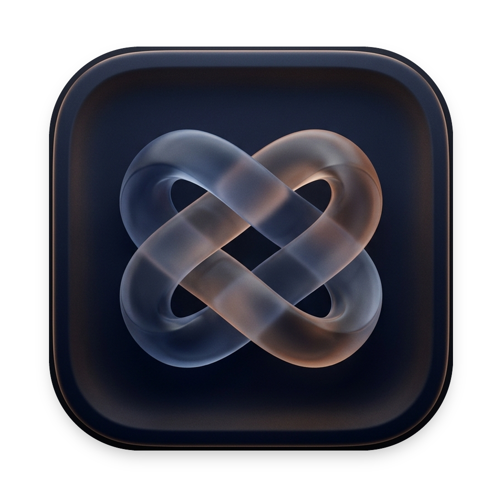

<div align="center">



# Waystation

**Chrome Web Store extensions → Safari. One click.**

[](https://github.com/pterodactylstfw/Waystation/releases)
[](https://apple.com/macos)
[](https://swift.org)
[](LICENSE)

[Download (v1.1.2)](https://github.com/pterodactylstfw/Waystation/releases/latest) · [Getting Started](#getting-started) · [Building From Source](#building-from-source)

</div>

---

## What is this?

Apple ships `safari-web-extension-converter` but actually using it means: downloading CRX files by hand, unpacking them, running terminal commands, patching Xcode projects, dealing with code-signing, and re-doing all of it every 7 days when your free dev certificate expires.

Waystation wraps that entire workflow into a native Mac app. Browse the Chrome Web Store, click "Add to Safari", done.

---

## Features

- **Built-in Chrome Web Store browser** — browse and install extensions without leaving the app. A native "Add to Safari" button is injected directly on extension pages.
- **Drag & drop** — already have a `.crx`, `.zip`, or unpacked extension folder? Drop it in.
- **Compatibility checks** — manifests are inspected before conversion. You'll know upfront if an extension uses Chrome-only APIs that won't work in Safari.
- **Automatic code-signing** — detects your Apple Development certificate from Keychain. Falls back to ad-hoc signing if you don't have one.
- **7-day auto-renewal** — free Apple dev certs expire weekly. A background `launchd` agent re-signs everything before that happens. You don't have to think about it.
- **Safari persistence helper** — monitors Safari's lifecycle and can help toggle "Allow Unsigned Extensions" without manual steps.
- **System Doctor** — one-click diagnostic that checks if Xcode CLT, `safari-web-extension-converter`, and Safari developer mode are set up correctly. Offers remediation if not.

Everything runs locally. No accounts, no telemetry, no data leaving your machine.

---

## Getting Started

### Prerequisites

- **macOS 14.0+** (Sonoma or Sequoia)
- **Xcode** (full install — needed for `safari-web-extension-converter`)
- **Xcode Command Line Tools**:
  ```bash
  xcode-select --install
  ```

### Safari Setup (one-time)

Converted extensions are signed with your personal dev certificate, so Safari needs developer mode enabled:

1. Safari → Settings (`⌘,`) → Advanced → enable **"Show features for web developers"**
2. Menu bar → Develop → check **"Allow Unsigned Extensions"** (requires password)

> [!IMPORTANT]
> Safari resets the "Allow Unsigned Extensions" flag every time it fully quits (`⌘Q`). To avoid this, close windows with **`⌘W`** instead — Safari stays in memory and your extensions keep working.

### Installing an Extension

1. Open Waystation → **Store** tab
2. Find an extension (Dark Reader, uBlock Origin, SponsorBlock, etc.)
3. Click **"Add to Safari"**
4. Waystation downloads the CRX, converts it, builds the container app, and signs it
5. Enable the extension in Safari → Settings → Extensions

That's it. The extension shows up in your Library with a signing status badge.

---

## Building From Source

```bash
git clone https://github.com/pterodactylstfw/Waystation.git
cd Waystation

# Debug build
xcodebuild -scheme MyApp -destination 'platform=macOS' build

# Release build
xcodebuild -scheme MyApp -configuration Release -destination 'platform=macOS' build
```

Or open `Waystation.xcodeproj` in Xcode and hit `⌘R`.

---

## How It Works

Under the hood, Waystation:

1. Downloads `.crx` binaries from Google's CDN (`clients2.google.com`)
2. Extracts and validates the extension manifest
3. Runs `xcrun safari-web-extension-converter` to generate an Xcode project
4. Patches the generated `project.pbxproj` (deployment target, bundle IDs)
5. Builds the `.app` container with `xcodebuild`
6. Signs both the `.app` and `.appex` bundles with your local identity
7. Registers the result with macOS LaunchServices so Safari picks it up

The background `launchd` agent (installed to `~/Library/LaunchAgents/`) checks certificate age daily and re-signs before the 7-day expiry.

---

## 🔒 Security & Privacy

- All conversions and signing happen on your machine — nothing is uploaded anywhere
- Extension archives come directly from Google's official CDN
- Conversions use Apple's built-in `xcrun safari-web-extension-converter`
- No analytics, no telemetry, no tracking

---

## ⚖️ Disclaimer

Waystation is an independent open-source project. Not affiliated with Apple or Google.

Chrome, Chrome Web Store, Safari, and macOS are trademarks of their respective owners. This tool is intended for personal use, interoperability, and testing. You're responsible for respecting the licenses of any extensions you convert.

---

## 📄 License

MIT — see [LICENSE](LICENSE) for details.
